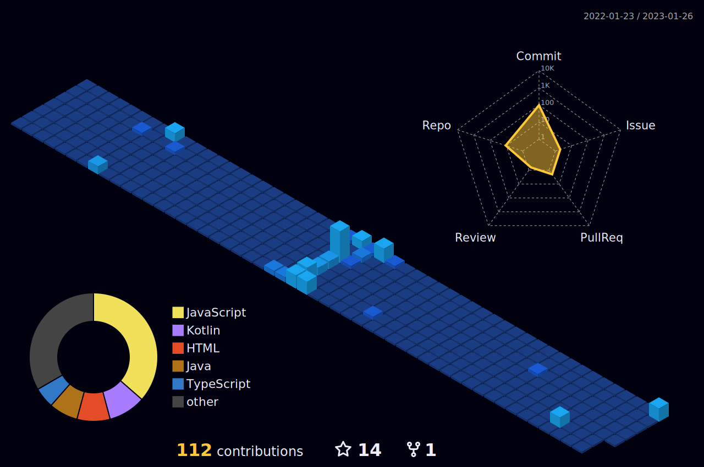

  

<h1> Hey, < Programmers/ >!  </h1>

</img>

 

&nbsp;&nbsp;&nbsp;&nbsp;
&nbsp;&nbsp;&nbsp;&nbsp;
<!--  -->

 

 

## Github Contribution Streak 🔥 
 

 

## Github Stats &nbsp;📊
 

 

## Most Used Languages 📚
 

<h6>Note : This does not indicate my skill level. This is only a metric of which languages have the most code on GitHub.</h6>

 

## 3D Contribution Calendar 📅
 

 

## Technology Stack 💻

</img>

### Programming Languages 👨‍💻 :
 

&nbsp;&nbsp;
&nbsp;&nbsp;
&nbsp;&nbsp;
&nbsp;&nbsp;
&nbsp;&nbsp;
&nbsp;&nbsp;

 

### Web Development 🌐 :
 

&nbsp;&nbsp;
&nbsp;&nbsp;

 

### Frameworks & Libraries 📦 :
 

&nbsp;&nbsp;
&nbsp;&nbsp;
&nbsp;&nbsp;

 

### IDEs/Editors 👨‍🔧 :
 

&nbsp;&nbsp;
&nbsp;&nbsp;
&nbsp;&nbsp;
&nbsp;&nbsp;

 

### Version Control 🔧 :
 

&nbsp;&nbsp;
&nbsp;&nbsp;

 

### Social Media 🔗 :
 

&nbsp;&nbsp;
&nbsp;&nbsp;

 

### Hosting 🌎 :
 

</img>

 

&nbsp;&nbsp;
&nbsp;&nbsp;
&nbsp;&nbsp;

 

<!-- ### Server 🗃️ :
 

  -->

 

### Database 💾 :
 

 

### Operating Systems 🐧 :
 

</img>

 

&nbsp;&nbsp;
&nbsp;&nbsp;
&nbsp;&nbsp;
&nbsp;&nbsp;

 

## Github Contributions 📈
 

 
<h2 align='center'>Support Me By Follwing or Starring ⭐ Some Of My Repositories!</h2>

  

  <h6>
    <strong>
      <em>
        For Fun: Please enjoy this snake eating my contributions away!🐍
      </em>
    </strong>
  </h6>

<h2 align='center'>Thank You!!</h2>
 
  

    
  

 
